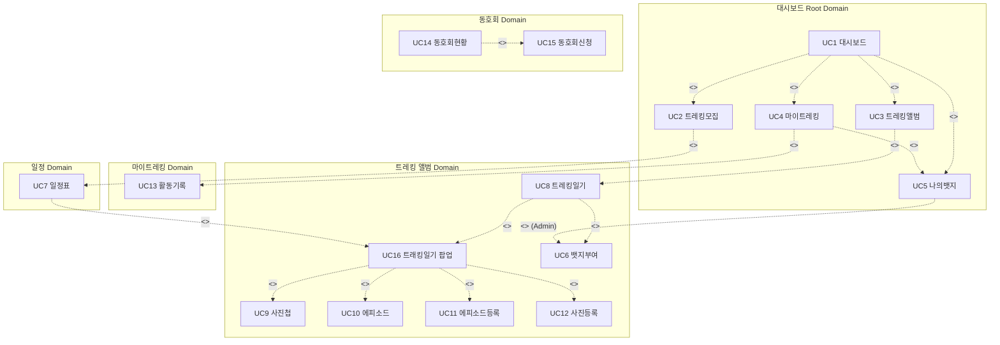
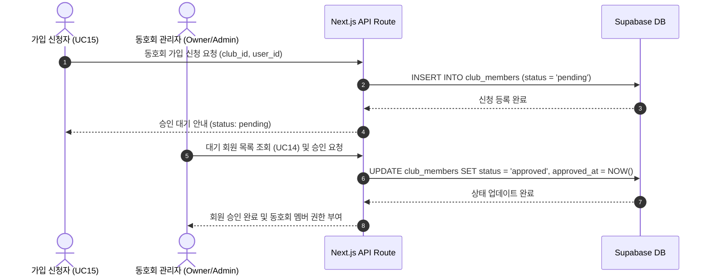
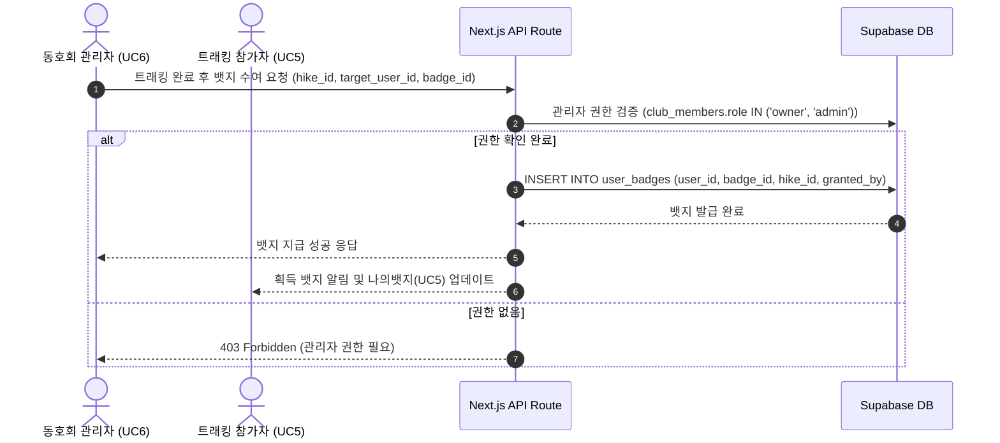
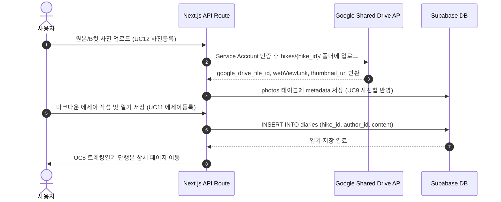

# 🏔️ 함께쓰는 Tracking 일기 아키텍처 및 시스템 가이드라인

본 문서는 **함께쓰는 Tracking 일기 (트래킹 추억 아카이브)** 프로젝트의 유스케이스 모델, 화면 구조, 데이터베이스 아키텍처, 구글 공유 드라이브 연동 전략 및 프론트엔드 디자인 스펙을 정의합니다.

---

## 1. 🎯 프로젝트 개요
- **프로젝트명**: 함께쓰는 Tracking 일기 (Shared Trekking Diary)
- **핵심 가치**: 등산/트래킹 동호회원들이 함께 작성하는 교환일기와 현장/B컷 사진을 디지털 아카이브 단행본으로 보관하는 아날로그 감성 서비스
- **기술 스택**:
  - **Frontend**: Next.js 14+ (App Router), TypeScript, Tailwind CSS, Shadcn UI
  - **Design System**: `tracking-diary-stitch` (Google Fonts: Bricolage Grotesque, Be Vietnam Pro, Space Grotesk)
  - **Backend / Database**: Supabase (PostgreSQL, Auth, Realtime)
  - **External Storage**: Google Shared Drive API v3 (Service Account 기반 원본/B컷 저장)

---

## 2. 📊 Use Case Model & Screen Structure (유스케이스 & 화면 구성)

### 2.1 Use Case 명세 (UC1 ~ UC15)

| UC ID | 유스케이스명 | 설명 | 주요 포함/연동 관계 | 매핑되는 화면 |
| :--- | :--- | :--- | :--- | :--- |
| **UC1** | **대시보드** | 사용자 맞춤 메인 대시보드 (모집, 앨범, 마이트레킹, 뱃지 요약) | `include UC2, UC3, UC4, UC5` | `대시보드 메인 (/)` |
| **UC2** | **트레킹모집** | 상단 모집 중인 트레킹 목록과 참가를 위한 일정 안내 | `include UC7` (일정표 연동) | `트레킹 모집 목록 (/hikes)` |
| **UC3** | **트레킹앨범** | 지난 트래킹들의 교환일기와 사진첩을 모아보는 디지털 서가 | `include UC8` | `단행본 앨범 아카이브 (/diaries)` |
| **UC4** | **마이트레킹** | 개인 트레킹 통계, 획득 뱃지, 활동 이력을 확인하는 마이페이지 | `include UC5, UC13` | `마이 페이지 (/my)` |
| **UC5** | **나의뱃지** | 사용자가 수집한 완등/참여 스탬프 및 뱃지 갤러리 (조회 전용 갤러리, 뱃지 부여 기능은 UC8로 이전) | UC4 하위 연동 | `나의 뱃지 갤러리 (/my/badges)` |
| **UC6** | **뱃지부여** | 동호회 관리자가 UC8 단위 트래킹일기 상단 참가자 아바타 클릭 시 뱃지를 수여하는 기능 | Admin 전용 액션 (UC8 내) | `뱃지 부여 모달/팝업` |
| **UC7** | **일정표** | 상단 모집 중인 트래킹 목록 & 하단 3개월 주차별 다이어리 캘린더 (열: 3개월 / 행: 1~5주차, 1주 1칸) | UC2 하위 연동 | `3개월 주차별 일정표 (/hikes)` |
| **UC8** | **트레킹일기** | 특정 트래킹의 디지털 단행본 아카이브 상세 페이지 (상단: 참가자 아바타 & 뱃지 수여 UC6 / 사진: 가로·세로 혼합 메이슨리 슬라이더 / 하단: 세로 수직 스크롤 에피소드 섹션) | `include UC6, UC16` | `트레킹 일기 상세 페이지 (/diaries/[id])` |
| **UC9** | **사진첩** | Google Shared Drive 연동 폴라로이드 갤러리 (가로·세로 비율 자동 유지 메이슨리 컬럼 레이아웃, 강제 제목 제거 및 메타데이터 칩 표출) | `include UC12` (사진 등록) | `사진첩 갤러리 (/gallery)` |
| **UC10** | **에피소드** | 트래킹 후기 및 트레킹 감상이 담긴 본문 에피소드 뷰 (다이어리 동기화 사진 선택 배치: 본문 상단 배너, 좌측 본문 카드, 하단 폴라로이드 렌더링) | `include UC11` (에피소드 등록) | `에피소드 상세 뷰 (UC8 내 피드)` |
| **UC11** | **에피소드등록** | 단위 트래킹일기(UC8) 내에서 해당 트래킹의 구글 공유 드라이브 사진(`photos` DB)을 선택하고 배치 스타일(상단/인라인/하단)을 지정하여 에피소드 작성 및 저장 | 에피소드 작성 액션 (UC8 내) | `에피소드 작성 폼 (UC8 단위 트레킹일기 내)` |
| **UC12** | **사진등록** | Google Shared Drive API를 활용한 원본 및 B컷 사진 업로드 | 사진 업로드 액션 | `사진 업로드 모달/폼` |
| **UC13** | **활동기록** | 누적 고도, 등반 거리, 참석률 등 트래킹 활동 타임라인 | UC4 하위 연동 | `활동 타임라인 (/my/activities)` |
| **UC14** | **동호회현황** | 개설된 동호회 목록, 멤버 현황 및 초청링크로 진입한 가입 신청 현황 조회 | `include UC15, UC17` | `동호회 현황 (/clubs)` |
| **UC15** | **동호회관리** | 회원 가입 승인, 신규 트레킹 일정 등록, 동호회 전용 뱃지 생성, 동호회 전용 구글 공유 드라이브 키 & Gemini AI Key 등록/관리 센터 | Admin 전용 액션 | `동호회 관리 센터 (/clubs/[id]/admin)` |
| **UC16** | **트래킹일기** | 일정표(UC7) 완등 클릭 시 팝업 렌더링. 참가자 동그란 사인 목록, 사진들, 에피소드 요약 표출 및 사진올리기(UC12), 에피소드등록(UC11) 연동 | `include UC9, UC10, UC11, UC12` | `트래킹일기 팝업 모달 (UC16)` |
| **UC17** | **동호회개설** | 사용자가 새로운 트레킹 동호회를 생성 및 개설 신청하는 기능 (가입은 초청 링크를 통해 유입 후 개설자 승인) | UC14 하위 연동 | `동호회 개설 신청 폼 (/clubs/new)` |

---

### 2.2 Use Case Diagram (include 관계 반영)



---

### 2.3 Screen Blueprint & Flat Directory Hierarchy (플랫 TSX 파일 명명 지침)

> 💡 **지침**: `.tsx` 페이지 파일은 하위 디렉터리(`subdirectory`)를 생성하지 않고, 디렉터리명을 파일명의 접두사(`prefix`)로 지정하여 `src/app/` 단일 폴더 직하위에 생성합니다. (예: `gallery_page.tsx`, `hikes_page.tsx`)

```
src/app/
├── dashboard_page.tsx           # [UC1] 대시보드 메인 (UC2, UC3, UC4, UC5 요약)
├── hikes_page.tsx               # [UC2] 트레킹모집 목록
├── hikes_id_page.tsx            # [UC7] 일정표 & 트레킹 모집 상세
├── diaries_page.tsx             # [UC3] 트레킹앨범 (단행본 서가)
├── diaries_id_page.tsx          # [UC8] 트레킹일기 상세 ([UC9] 사진첩 + [UC10] 에피소드 + [UC11] 에피소드등록)
├── gallery_page.tsx             # [UC9] 사진첩 & [UC12] 사진등록 (Google Drive 연동)
├── my_page.tsx                  # [UC4] 마이트레킹 메인
├── my_badges_page.tsx           # [UC5] 나의뱃지
├── my_activities_page.tsx       # [UC13] 활동기록 (타임라인)
├── clubs_page.tsx               # [UC14] 동호회현황 목록 & 초청링크 가입 관리자 승인
├── clubs_admin_page.tsx         # [UC15] 동호회 종합 관리 센터 (회원 승인, 일정 등록, 뱃지 생성, API Key 설정)
└── clubs_new_page.tsx           # [UC17] 동호회개설 신청
```

---

## 3. 🗄️ Database Architecture (Supabase / PostgreSQL)

### 3.1 DDL SQL Schema

```sql
-- 1. Users Table (auth.users 연동 - Kakao, Google 등 Social OAuth 회원가입만 허용)
CREATE TABLE public.users (
  id UUID PRIMARY KEY REFERENCES auth.users(id) ON DELETE CASCADE,
  email TEXT NOT NULL,
  nickname TEXT NOT NULL,
  avatar_url TEXT,
  provider TEXT NOT NULL CHECK (provider IN ('kakao', 'google', 'naver', 'oauth')), -- OAuth 소셜 로그인 제공자
  provider_id TEXT, -- OAuth 고유 식별자
  character_type TEXT DEFAULT 'beginner',
  created_at TIMESTAMPTZ DEFAULT NOW()
);

-- 2. Clubs Table (동호회 메타데이터 & 구글드라이브/AI API 키 연동 - UC14, UC15, UC17)
CREATE TABLE public.clubs (
  id BIGINT PRIMARY KEY GENERATED ALWAYS AS IDENTITY, -- Sequential Max ID (user_id 외 정수 PK)
  owner_id UUID NOT NULL REFERENCES public.users(id) ON DELETE CASCADE,
  name TEXT NOT NULL,
  category TEXT NOT NULL CHECK (category IN ('hiking', 'running', 'cycling', 'tracking', 'general')),
  description TEXT,
  logo_url TEXT,
  google_drive_folder_id TEXT, -- 해당 동호회 전용 구글 공유 드라이브 폴더 ID
  google_drive_credentials_json TEXT, -- 서비스 계정 인증 JSON
  gemini_api_key TEXT, -- AI 에피소드 윤색 및 맥락 분석용 Gemini API Key
  created_at TIMESTAMPTZ DEFAULT NOW()
);

-- 3. Club Members Table (동호회 가입 신청, 승인 및 관리자 권한 지정 - UC14, UC15)
CREATE TABLE public.club_members (
  club_id BIGINT REFERENCES public.clubs(id) ON DELETE CASCADE,
  user_id UUID REFERENCES public.users(id) ON DELETE CASCADE,
  role TEXT DEFAULT 'member' CHECK (role IN ('owner', 'admin', 'member')), -- 동호회 관리자 권한 지정 (owner, admin, member)
  status TEXT DEFAULT 'pending' CHECK (status IN ('pending', 'approved', 'rejected')),
  applied_at TIMESTAMPTZ DEFAULT NOW(),
  approved_at TIMESTAMPTZ,
  PRIMARY KEY (club_id, user_id)
);

-- 4. Hikes Table (트래킹 모집 및 일정 - UC2, UC7)
CREATE TABLE public.hikes (
  id BIGINT PRIMARY KEY GENERATED ALWAYS AS IDENTITY, -- Sequential Max ID
  club_id BIGINT REFERENCES public.clubs(id) ON DELETE CASCADE,
  organizer_id UUID NOT NULL REFERENCES public.users(id) ON DELETE CASCADE,
  title TEXT NOT NULL,
  mountain_name TEXT NOT NULL,
  hike_date TIMESTAMPTZ NOT NULL,
  difficulty TEXT CHECK (difficulty IN ('easy', 'medium', 'hard', 'expert')),
  status TEXT DEFAULT 'recruiting' CHECK (status IN ('recruiting', 'completed', 'cancelled')),
  description TEXT,
  created_at TIMESTAMPTZ DEFAULT NOW()
);

-- 5. Hike Members Table (트래킹 신청상태 및 참여완료 관리 - UC2, UC7, UC8)
CREATE TABLE public.hike_members (
  hike_id BIGINT REFERENCES public.hikes(id) ON DELETE CASCADE,
  user_id UUID REFERENCES public.users(id) ON DELETE CASCADE,
  role TEXT DEFAULT 'member' CHECK (role IN ('organizer', 'member')),
  status TEXT DEFAULT 'applied' CHECK (status IN ('applied', 'approved', 'rejected', 'completed')), -- 신청상태(applied), 승인(approved), 거절(rejected), 참여완료(completed)
  joined_at TIMESTAMPTZ DEFAULT NOW(),
  completed_at TIMESTAMPTZ, -- 참여완료 일시
  PRIMARY KEY (hike_id, user_id)
);

-- 6. Episodes Table (episodes 테이블 명칭 변경 및 다중 사진 링크 배열 저장 - UC3, UC8, UC10, UC11)
CREATE TABLE public.episodes (
  id BIGINT PRIMARY KEY GENERATED ALWAYS AS IDENTITY, -- Sequential Max ID
  hike_id BIGINT NOT NULL REFERENCES public.hikes(id) ON DELETE CASCADE,
  author_id UUID NOT NULL REFERENCES public.users(id) ON DELETE CASCADE,
  title TEXT NOT NULL,
  content TEXT NOT NULL,
  photo_urls TEXT[], -- 다중 사진 링크 배열 저장 (Multi-Photo Links)
  is_published BOOLEAN DEFAULT true,
  created_at TIMESTAMPTZ DEFAULT NOW()
);

-- 7. Photos Table (Google Shared Drive 연동 사진 metadata - UC9, UC12)
CREATE TABLE public.photos (
  id BIGINT PRIMARY KEY GENERATED ALWAYS AS IDENTITY, -- Sequential Max ID
  hike_id BIGINT NOT NULL REFERENCES public.hikes(id) ON DELETE CASCADE,
  episode_id BIGINT REFERENCES public.episodes(id) ON DELETE SET NULL,
  uploader_id UUID NOT NULL REFERENCES public.users(id) ON DELETE CASCADE,
  google_drive_file_id TEXT NOT NULL,
  google_drive_web_link TEXT NOT NULL,
  thumbnail_url TEXT,
  is_bside BOOLEAN DEFAULT false,
  created_at TIMESTAMPTZ DEFAULT NOW()
);

-- 8. Badges Table (완등/참여 뱃지 정의 - UC5, UC6)
CREATE TABLE public.badges (
  id BIGINT PRIMARY KEY GENERATED ALWAYS AS IDENTITY, -- Sequential Max ID
  club_id BIGINT REFERENCES public.clubs(id) ON DELETE CASCADE,
  name TEXT NOT NULL,
  icon_name TEXT NOT NULL,
  description TEXT,
  created_at TIMESTAMPTZ DEFAULT NOW()
);

-- 9. User Badges Table (하이킹 참여자 뱃지 수여 - UC5, UC6)
CREATE TABLE public.user_badges (
  id BIGINT PRIMARY KEY GENERATED ALWAYS AS IDENTITY, -- Sequential Max ID
  user_id UUID NOT NULL REFERENCES public.users(id) ON DELETE CASCADE,
  badge_id BIGINT NOT NULL REFERENCES public.badges(id) ON DELETE CASCADE,
  hike_id BIGINT REFERENCES public.hikes(id) ON DELETE SET NULL,
  granted_by UUID NOT NULL REFERENCES public.users(id) ON DELETE SET NULL,
  earned_at TIMESTAMPTZ DEFAULT NOW(),
  UNIQUE (user_id, badge_id, hike_id)
);

-- Row Level Security (RLS) Enable
ALTER TABLE public.users ENABLE ROW LEVEL SECURITY;
ALTER TABLE public.clubs ENABLE ROW LEVEL SECURITY;
ALTER TABLE public.club_members ENABLE ROW LEVEL SECURITY;
ALTER TABLE public.hikes ENABLE ROW LEVEL SECURITY;
ALTER TABLE public.hike_members ENABLE ROW LEVEL SECURITY;
ALTER TABLE public.episodes ENABLE ROW LEVEL SECURITY;
ALTER TABLE public.photos ENABLE ROW LEVEL SECURITY;
ALTER TABLE public.badges ENABLE ROW LEVEL SECURITY;
ALTER TABLE public.user_badges ENABLE ROW LEVEL SECURITY;
```

---

## 4. 🔄 Sequence Diagrams (핵심 프로세스)

### 4.1 동호회 가입 신청 및 승인 프로세스 (UC14 동호회현황 -> UC15 동호회신청)



---

### 4.2 뱃지 부여 프로세스 (UC6 뱃지부여 -> UC5 나의뱃지)



---

### 4.3 사진 업로드 & 트레킹 일기 등록 프로세스 (UC8 -> UC9/UC10 -> UC11/UC12)



---

## 5. 🖼️ Google Shared Drive Integration Strategy

1. **서비스 계정(Service Account) 인증**:
   - Backend API Route (`/api/drive/upload`)에서 Google Service Account JWT Client를 통해 Shared Drive에 직접 접근합니다.
2. **트래킹별 폴더 자동 구조화**:
   - 트래킹 등록(UC2) 시 Shared Drive 내 `hikes/{hike_id}/` 디렉터리를 자동 생성합니다.
3. **대용량 파일 메타데이터 처리**:
   - 사진 원본은 Google Shared Drive에 저장하며, Supabase `photos` 테이블에는 `google_drive_file_id`, `google_drive_web_link`, `thumbnail_url`, `is_bside` 태그 메타데이터만 기재합니다.

---

### 5.1 UC10 에피소드 다중 사진 레이아웃 & AI 작성 지원 가이드 (Technical Note)

1. **다중 사진 동적 레이아웃 아키텍처 (Multi-Photo Layout Architecture)**:
   - **스마트 콜라주 그리드 (Grid Collage)**: 사진 개수별 동적 레이아웃 지원 (2장: 1:1 분할/사선 Overlap, 3장: 메인 대형 1장 + 세로 스택 2장, 4장 이상: 2x2 쿼드/메이슨리).
   - **잡지 에디토리얼 교차 배치 (Magazine Layout)**: 단행본 잡지 스타일로 글 문단과 사진이 교대로 스며드는 인라인 배치.
   - **인스탁스 필름 스트립 (Film Strip Carousel)**: 팝업 모달 상단 필름 띠 슬라이더 및 고화질 원본 확대 기능.

2. **AI 기반 에피소드 작성 및 레이아웃 스마트 연동 (AI Writing & Smart Layout Assistant)**:
   - **사진-텍스트 맥락 자동 분석**: 사진 EXIF 타임스탬프와 이미지를 AI(Gemini API 등)가 인식하여 글 맥락에 최적화된 위치에 자동 배치.
   - **AI 멀티 스타일 변환기 (AI Writing Generator)**: 2~3줄의 간단한 아이디어 메모를 감성 수필 톤, 디지털 잡지 인터뷰 톤, SNS 숏폼 톤 등으로 자동 완성 및 윤색.
   - **AI 하이라이트 요약 & 뱃지 자동 추천**: 에피소드 핵심 요약 3줄 카드 및 수여에 적합한 완등 스탬프 뱃지 자동 추천 연동.

---

## 6. 🎨 Design System Guide (`tracking-diary-stitch`)

### 6.1 Theme Tokens & Palette

- **Color Tokens**:
  - `Primary (Forest Green)`: `#012d1d` (메인 바 & 주요 CTA 버튼)
  - `Primary Container`: `#1b4332` (카드 헤더 & 강조 컴포넌트)
  - `Background / Paper`: `#fdfae7` (아날로그 종이 질감 배경)
  - `Secondary (Earth & Sun)`: `#7d562d` / `#ffca98` (뱃지 테두리 & 날씨 칩)
  - `Tertiary (Terracotta)`: `#500c00` / `#741b04` (완등 스탬프 & 경고)
- **Typography Tokens (Google Fonts)**:
  - `Bricolage Grotesque`: 헤더 및 단행본 타이틀 폰트 (700 / 800)
  - `Be Vietnam Pro`: 가독성 높은 일기 본문 & 에세이 폰트 (400 / 500)
  - `Space Grotesk`: 고도, 거리, 코스 데이터 레이블 폰트 (500)

### 6.2 Key UI Components

1. **PolaroidCard (`UC9 사진첩`)**: 흰색 굵은 여백 프레임, 마스킹 테이프 장식, `Space Grotesk` 날짜 표기.
2. **SummitBadge (`UC5 나의뱃지`)**: 아날로그 스탬프 질감 오버레이. 획득 시 Terracotta 색상, 미획득 시 흑백 투명도 30%.
3. **HikeRecruitCard (`UC2 트레킹모집`)**: 트래킹 난이도 칩, 참가자 아바타 그룹 및 참가 신청 버튼.
4. **BadgeGrantModal (`UC6 뱃지부여`)**: 동호회 관리자 전용 뱃지 수여 및 멤버 체크박스 모달.
